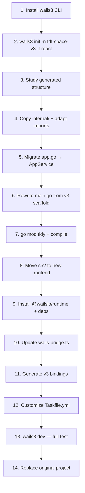

# Wails v2 → v3 Migration (Init-based Approach)

Use `wails3 init` to scaffold a fresh v3 project, then migrate existing TDT Space code into the new structure. This ensures correct v3 project scaffolding (Taskfile.yml, build configs, correct Go module setup) out-of-the-box.

## User Review Required

> [!IMPORTANT]
> Wails v3 is currently in **alpha** (`v3alpha`). API is reasonably stable but may change before final release.

> [!WARNING]
> The new project will be created in a separate directory (e.g., `E:\tdt-space-v3`). After verifying everything works, we replace the original project files.

## Proposed Changes

### Phase 0: Scaffold New v3 Project

1. **Install Wails v3 CLI**:
   ```bash
   go install github.com/wailsapp/wails/v3/cmd/wails3@latest
   ```

2. **Create new project**:
   ```bash
   wails3 init -n tdt-space-v3 -t react
   ```
   This generates:
   - [main.go](file:///E:/tdt-clone/main.go) — v3 application entry point with correct `application.New()` pattern
   - `Taskfile.yml` — build system (replaces [wails.json](file:///E:/tdt-clone/wails.json))
   - [build/](file:///E:/tdt-clone/internal/services/terminal.go#501-517) — platform-specific build configs (windows/, darwin/, linux/)
   - `frontend/` — React frontend scaffold
   - [go.mod](file:///E:/tdt-clone/go.mod) / `go.sum` — with v3 dependency already configured

3. **Study the generated structure** to understand v3 conventions before migrating

---

### Phase 1: Migrate Backend Go Code

#### Copy `internal/` directory

Copy `internal/services/` and `internal/platform/` from old project. Then update:

#### [MODIFY] `internal/services/terminal.go`

```diff
-import wailsruntime "github.com/wailsapp/wails/v2/pkg/runtime"
+import "github.com/wailsapp/wails/v3/pkg/application"

-Ctx context.Context
+app *application.Application

-wailsruntime.EventsEmit(t.Ctx, "terminal-data", payload)
+t.app.Events.Emit(&application.WailsEvent{Name: "terminal-data", Data: payload})
```

#### [MODIFY] `internal/services/terminal_batching.go`

```diff
-import "github.com/wailsapp/wails/v2/pkg/runtime"
+import "github.com/wailsapp/wails/v3/pkg/application"

-ctxGetter func() context.Context
+appGetter func() *application.Application

-runtime.EventsEmit(ctx, "terminal-data", data)
+app.Events.Emit(&application.WailsEvent{Name: "terminal-data", Data: data})
```

#### [MODIFY] `internal/services/system.go`

```diff
-import wailsruntime "github.com/wailsapp/wails/v2/pkg/runtime"
+import "github.com/wailsapp/wails/v3/pkg/application"

-Ctx context.Context
+app *application.Application

-wailsruntime.OpenDirectoryDialog(s.Ctx, opts)
+application.OpenDirectoryDialog() // v3 dialog API
```

#### [MODIFY] `app.go` → Adapt to v3 Service

```diff
-type App struct {
-    ctx context.Context
-    ...
-}
-func (a *App) startup(ctx context.Context) { a.ctx = ctx }
+type AppService struct {
+    app *application.Application
+    ...
+}
+func (a *AppService) ServiceStartup(ctx context.Context, options application.ServiceOptions) error {
+    a.app = options.Application
+    return nil
+}
```

- `runtime.EventsEmit(ctx, ...)` → `a.app.Events.Emit(...)`
- `runtime.Quit(ctx)` → `a.app.Quit()`
- Window controls use `a.app.CurrentWindow()` methods
- Menu uses v3's `application.NewMenu()` builder

#### [MODIFY] `main.go` — Use v3 scaffold as base

Start from the generated `main.go` and add existing services:

```go
app := application.New(application.Options{
    Name: "TDT Space",
    Services: []application.Service{
        application.NewService(&appSvc),
        application.NewService(&terminalSvc),
        application.NewService(&workspaceSvc),
        application.NewService(&storeSvc),
        application.NewService(&systemSvc),
        application.NewService(&imeSvc),
    },
    Assets: application.AssetOptions{
        Handler: application.AssetFileServerFS(assets),
    },
})

app.NewWebviewWindowWithOptions(application.WebviewWindowOptions{
    Title:     "TDT Space",
    Width:     1400,
    Height:    900,
    Frameless: true,
    // ... other window options
})

app.Run()
```

---

### Phase 2: Migrate Frontend

#### Move existing `src/` code
- Copy `src/` from old project into the new project's `frontend/` (or root, depending on Vite config)
- Preserve existing `package.json` dependencies but add `@wailsio/runtime`

#### [MODIFY] `wails-bridge.ts`

```diff
-// v2: window.go.main.App.SpawnTerminal(...)
-// v2: window.runtime.EventsOn("terminal-data", handler)
+import { Events, Window } from '@wailsio/runtime'
+import { SpawnTerminal } from './bindings/main/TerminalService'
+
+// v3: Direct binding call
+const result = await SpawnTerminal(agentId, workspaceId, ...)
+
+// v3: Event subscription
+Events.On("terminal-data", (event) => { ... })
```

#### [MODIFY] `backend-legacy.ts`
- Remove `window.go` and `window.runtime` type declarations
- Or replace with v3 binding imports

#### Generate v3 bindings
```bash
wails3 generate bindings -ts
```

---

### Phase 3: Build System

The scaffolded project already provides:
- `Taskfile.yml` — customize `APP_NAME: "tdt-space"`
- `build/windows/Taskfile.yml` — Windows-specific build tasks
- `build/windows/nsis/` — NSIS installer support

#### [MODIFY] `Taskfile.yml`
- Set `APP_NAME: "tdt-space"` 
- Configure custom build flags (`-trimpath`, `-ldflags`, UPX compression)

#### [MODIFY] `build.bat`
- Update all `wails` → `wails3` command references
- Or replace with `task` commands from Taskfile

#### [MODIFY] `package.json`
- Add `@wailsio/runtime` dependency
- Update scripts: `wails3 dev`, `wails3 build`

#### [DELETE] `wails.json`
- Not needed in v3 (replaced by Taskfile.yml + build/config.yml)

---

### Phase 4: Finalize

1. Copy assets (icons, etc.) from old project to new
2. Run `go mod tidy`
3. Verify with `go build ./...`
4. Verify frontend: `bun run build`
5. Test with `wails3 dev`
6. Replace old project with new project files

---

### Migration Flow



## Verification Plan

### Automated
```bash
# Go compilation
go build ./...

# Frontend build
bun run build

# Wails doctor
wails3 doctor
```

### Manual (User)
1. `wails3 dev` — app window appears with frameless title bar
2. Terminal spawns and accepts input
3. Agent spawning works
4. Terminal resize, data flow, and kill work correctly
5. Title bar buttons (minimize/maximize/close) functional
6. File dialogs work
7. Store persistence across restarts
